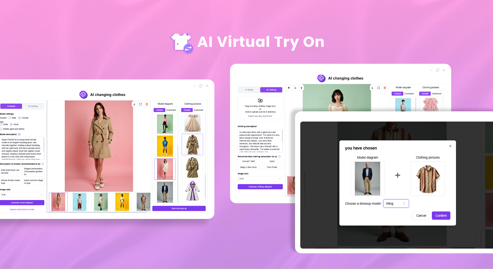
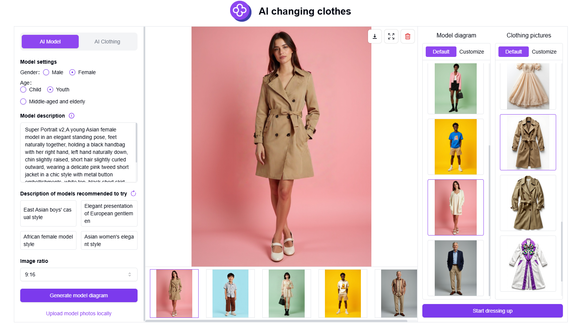
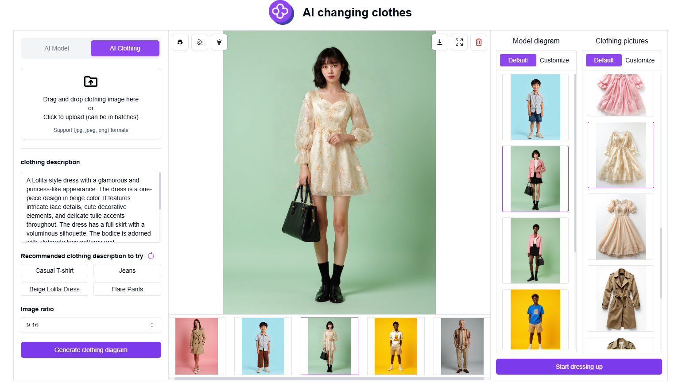
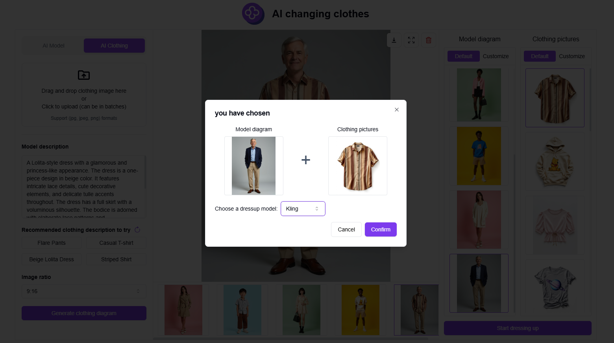

# <p align="center"> 👗 AI Virtual Try On 🚀✨</p>

<p align="center">AI Virtual Try On allows you to upload locally or use AI-generated model and clothing images, freely choose models and outfits for AI try-on, and generate model wearing pictures.</p>

<p align="center"><a href="https://302.ai/en/tools/tryon/" target="blank"></a></p >

<p align="center"><a href="README_zh.md">中文</a> | <a href="README.md">English</a> | <a href="README_ja.md">日本語</a></p>



This is the open-source version of the [AI Virtual Try On](https://302.ai/en/tools/tryon/) from [302.AI](https://302.ai/en/). You can directly log in to 302.AI to use the online version with zero code and zero background, or modify and deploy it yourself according to your requirements.


## Interface Preview
Based on model description and parameter settings, use AI to generate model images or upload model images locally. The model images will be displayed on the right side.
       

Based on clothing description and parameter settings, use AI to generate clothing images or upload clothing images locally. The clothing images will be displayed on the right side.
           

Select the model to use for try-on and start the AI virtual try-on process.
     


## Project Features
### 👚 Model Images
Generate model images using AI based on model descriptions and parameter settings, or upload model images locally.
### 🙎‍♂️ Clothing Images
Generate clothing images using AI based on clothing descriptions and parameter settings, or upload clothing images locally.
### 🧚 AI Try-On
Select the model you want to use and start the AI virtual try-on.
### 📜 History Records
Save your creation history, never lose your memories, download anytime, anywhere.
### 🌓 Dark Mode
It supports dark mode to protect your eyes.
### 🌍 Multi-language Support
- Chinese Interface
- English Interface
- Japanese Interface

## 🚩 Future Update Plans
- [ ] New Feature: High-Resolution Portraits
- [ ] New Feature: Background Removal
- [ ] New Feature: Secondary Lighting

## 🛠️ Tech Stack

- **Framework**: Next.js 14
- **Language**: TypeScript
- **Styling**: TailwindCSS
- **UI Components**: Radix UI
- **State Management**: Jotai
- **Form Handling**: React Hook Form
- **HTTP Client**: ky
- **i18n**: next-intl
- **Theming**: next-themes
- **Code Standards**: ESLint, Prettier
- **Commit Standards**: Husky, Commitlint

## Development & Deployment
1. Clone the project
```bash
git clone https://github.com/302ai/302_clothing_change
cd 302_clothing_change
```

2. Install dependencies
```bash
pnpm install
```

3. Configure environment
```bash
cp .env.example .env.local
```
Modify the environment variables in `.env.local` as needed.

4. Start development server
```bash
pnpm dev
```

5. Build for production
```bash
pnpm build
pnpm start
```


## ✨ About 302.AI ✨
[302.AI](https://302.ai/en/) is an enterprise-oriented AI application platform that offers pay-as-you-go services, ready-to-use solutions, and an open-source ecosystem.✨
1. 🧠 Comprehensive AI capabilities: Incorporates the latest in language, image, audio, and video models from leading AI brands.
2. 🚀 Advanced application development: We build genuine AI products, not just simple chatbots.
3. 💰 No monthly fees: All features are pay-per-use, fully accessible, ensuring low entry barriers with high potential.
4. 🛠 Powerful admin dashboard: Designed for teams and SMEs - managed by one, used by many.
5. 🔗 API access for all AI features: All tools are open-source and customizable (in progress).
6. 💡 Powerful development team: Launching 2-3 new applications weekly with daily product updates. Interested developers are welcome to contact us.
