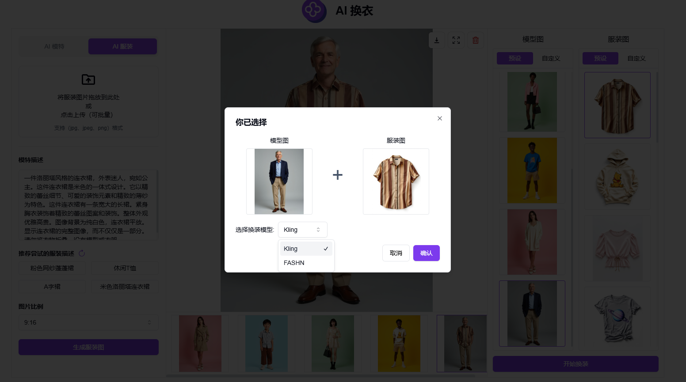
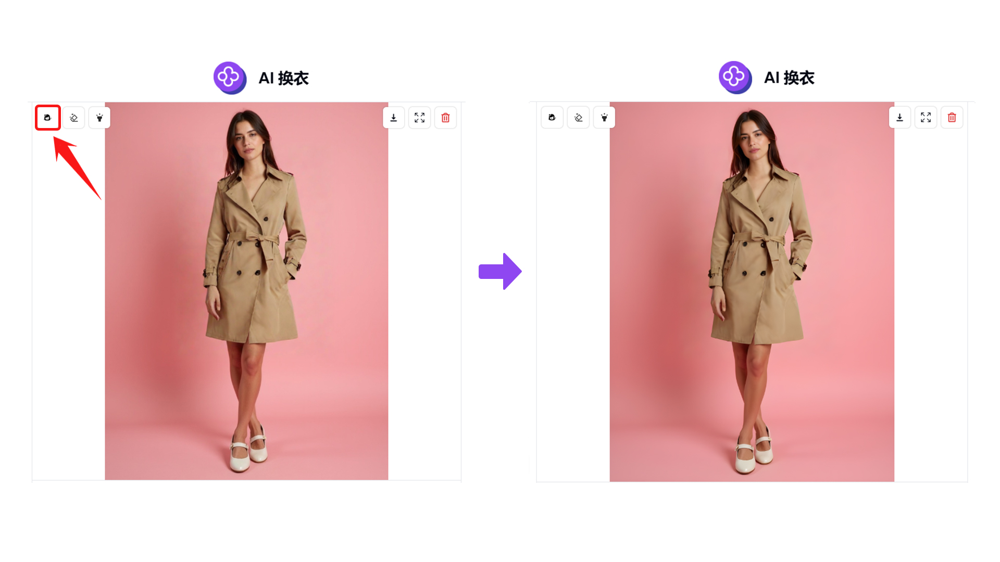
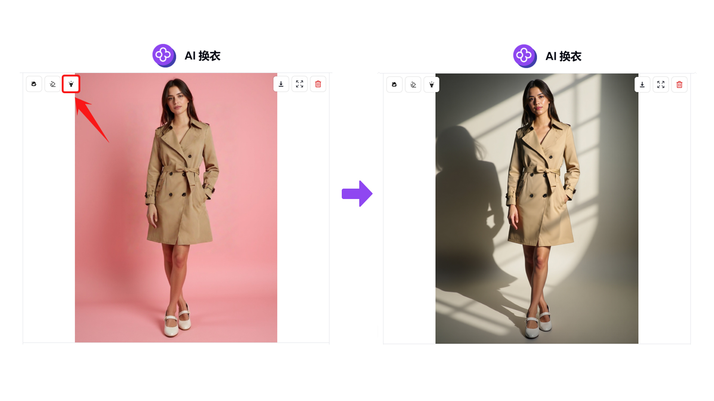

# <p align="center"> 👗 AI 换衣 🚀✨</p>

<p align="center">AI换衣通过本地上传或使用AI生成模特图和服装图，可自由选择模特和服饰进行AI换装并生成模特试穿图片。</p>

<p align="center"><a href="https://302.ai/tools/tryon/" target="blank"></a></p >

<p align="center"><a href="README_zh.md">中文</a> | <a href="README.md">English</a> | <a href="README_ja.md">日本語</a></p>


来自[302.AI](https://302.ai)的[AI换衣](https://302.ai/tools/tryon/)的开源版本。你可以直接登录302.AI，零代码零配置使用在线版本。或者对本项目根据自己的需求进行修改，传入302.AI的API KEY，自行部署。

## 界面预览
根据模特描述和参数设置，使用AI生成模特图或本地上传模特图，模特图会在右侧进行展示。  
       

根据服装描述和参数设置，使用AI生成服装图或本地上传服装图，服装图会在右侧进行展示。  
       

选择换装使用的模型，开始进行AI换装。


高清人像功能，使图片变得更清晰。
        

消除背景功能，一键去除图片背景。
    

二次打光功能，支持输入打光描述或上传背景图片，选择光源方向，即可对图片进行二次打光。
     

二次打光后的换装图。
 

## 项目特性
### 👚 模特图
根据模特描述和参数设置，使用AI生成模特图或本地上传模特图。   
### 🙎‍♂️ 服装图
根据服装描述和参数设置，使用AI生成服装图或本地上传服装图。
### 🧚 AI换装
选择你想使用的模型，即可开始AI换装。
### 🖼️ 高清人像
生成换装图后，使用AI使图片变得更高清。
### ✂️ 消除背景
生成换装图后，使用AI消除背景。
### 🔦 二次打光
生成换装图后，使用AI进行二次打光。 
### 📜 历史记录
保存您的创作历史,记忆不丢失，随时随地都可以下载。
### 🌓 暗色模式
支持暗色模式，保护您的眼睛。
### 🌍 多语言支持
  - 中文界面
  - English Interface
  - 日本語インターフェース

## 🚩 未来更新计划
- [ ] 支持同时选择上衣和下装，实现一套全身搭配

## 🛠️ 技术栈

- **框架**: Next.js 14
- **语言**: TypeScript
- **样式**: TailwindCSS
- **UI组件**: Radix UI
- **状态管理**: Jotai
- **表单处理**: React Hook Form
- **HTTP客户端**: ky
- **国际化**: next-intl
- **主题**: next-themes
- **代码规范**: ESLint, Prettier
- **提交规范**: Husky, Commitlint

## 开发&部署
1. 克隆项目
```bash
git clone https://github.com/302ai/302_virtual_try_on
cd 302_virtual_try_on
```

2. 安装依赖
```bash
pnpm install
```

3. 环境配置
```bash
cp .env.example .env.local
```
根据需要修改 `.env.local` 中的环境变量。

4. 启动开发服务器
```bash
pnpm dev
```

5. 构建生产版本
```bash
pnpm build
pnpm start
```

## ✨ 302.AI介绍 ✨
[302.AI](https://302.ai)是一个面向企业的AI应用平台，按需付费，开箱即用，开源生态。✨
1. 🧠 集合了最新最全的AI能力和品牌，包括但不限于语言模型、图像模型、声音模型、视频模型。
2. 🚀 在基础模型上进行深度应用开发，我们开发真正的AI产品，而不是简单的对话机器人
3. 💰 零月费，所有功能按需付费，全面开放，做到真正的门槛低，上限高。
4. 🛠 功能强大的管理后台，面向团队和中小企业，一人管理，多人使用。
5. 🔗 所有AI能力均提供API接入，所有工具开源可自行定制（进行中）。
6. 💡 强大的开发团队，每周推出2-3个新应用，产品每日更新。有兴趣加入的开发者也欢迎联系我们